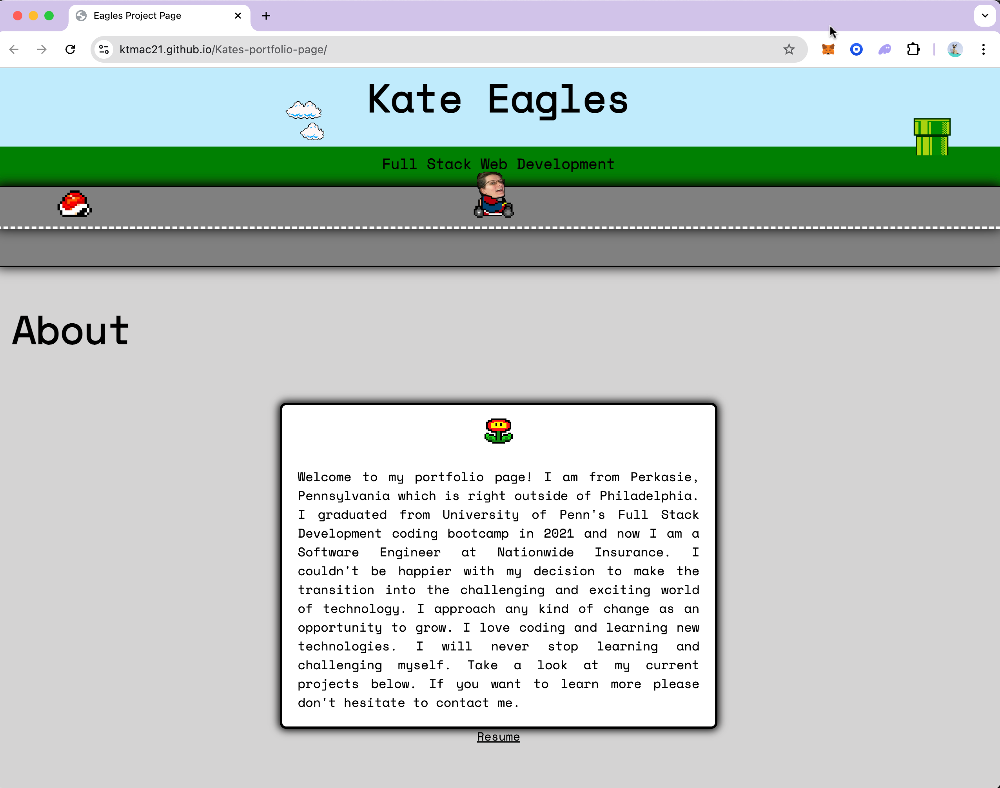

# Kate Eagles - Portfolio

## Description

This is my professional portfolio website, showcasing my skills as a Full Stack Web Developer. The site features a unique, Mario-themed design that demonstrates both my coding abilities and my creative approach to web development.

Key features include:
- An interactive header with animated elements
- An 'About Me' section introducing my background and skills
- A projects showcase highlighting my recent work
- Contact information and links to my professional profiles
- A responsive design that works well on both desktop and mobile devices

## Table of Contents
* [Live Site](#live-site)
* [Technologies Used](#technologies-used)
* [Usage](#usage)
* [Features](#features)
* [License](#license)
* [Questions](#questions)

## Live Site

Visit my portfolio here: [Kate Eagles Portfolio](https://ktmac21.github.io/Kates-portfolio-page/)

## Technologies Used

- HTML5
- CSS3
- JavaScript
- Google Fonts
- Font Awesome
- Responsive Design

## Usage

Navigate through the site to learn more about me and my projects:
1. Read the 'About' section to get to know me
2. Scroll through my featured projects
3. Click on the coin icons to view live projects
4. Use the contact links in the footer to reach out or view my professional profiles
5. Download my resume for a detailed look at my experience and skills

## Features

- **Animated Header**: Features a Mario Kart-inspired animation
- **Project Showcase**: Highlights my best work with descriptions and links
- **Responsive Design**: Ensures a great experience on all device sizes
- **Interactive Elements**: Coin icons serve as clickable links to projects
- **Easy Contact**: Multiple ways to connect, including GitHub, LinkedIn, email, and phone

## License

This project is licensed under the MIT License. For more information, please visit: 
https://opensource.org/licenses/MIT

## Questions

Feel free to reach out if you have any questions or would like to collaborate!

- GitHub: [ktmac21](https://github.com/ktmac21)
- Email: kteagles21@gmail.com
- LinkedIn: [Kate Eagles](https://www.linkedin.com/in/kate-eagles)

